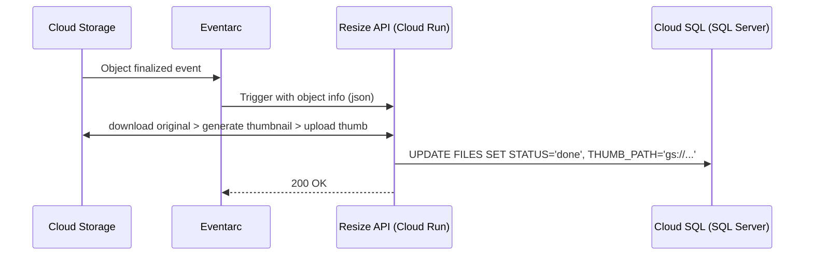

```mermaid
sequenceDiagram
    participant GCS as Cloud Storage
    participant EVT as Eventarc
    participant RZ  as Resize API (Cloud Run)
    participant DB  as Cloud SQL (SQL Server)
    GCS->>EVT: Object finalized event
    EVT->>RZ: Trigger with object info (json)
    RZ<<->>GCS: download original > generate thumbnail > upload thumb
    RZ->>DB: UPDATE FILES SET STATUS='done', THUMB_PATH='gs://...'
    RZ-->>EVT: 200 OK
```